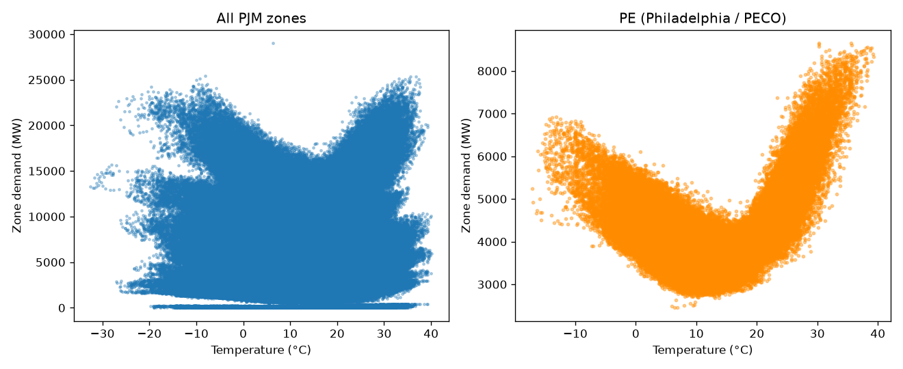

# GridFlex

**Forecasting PJM grid load and carbon intensity, and quantifying what a
megawatt of flexible demand is worth — by zone, by hour.**

Electricity must be generated the instant it's consumed, so the mix of
plants running at any moment sets both the price and the carbon intensity of
a kilowatt-hour — and that varies enormously by hour and by location. A
small but fast-growing slice of demand is **flexible**: EV charging, data
center compute, batteries, and industrial processes can often run now or
three hours from now without anyone noticing.

This project forecasts *when and where* the PJM grid (the 20-zone RTO
covering ~65M people, from Chicago to DC to Philadelphia) is dirtiest and
most strained, then quantifies what a megawatt of flexible demand is worth
if you move it — the central question facing a grid where data centers are
projected to drive peak demand up ~58% by 2046.

**Status:** Week 1 complete — automated ingestion pipeline is live and
running daily. Forecasting model, live dashboard, and the flexibility-value
engine are Weeks 2-4 (see [Roadmap](#roadmap) below).

## Live sanity check



The classic V-shape: demand is lowest around 15-20°C (nothing running),
rises at both extremes (heating in the cold, AC in the heat). Confirms the
weather join is physically sound across ~1.3M zone-hours, 2019-2026.

## Data sources

| Source | What it provides | Access |
|---|---|---|
| [EIA API v2](https://www.eia.gov/opendata/) (EIA-930) | Hourly demand, PJM's own day-ahead forecast, generation by fuel type, by zone and system-wide, 2019-present | Free API key |
| [Open-Meteo](https://open-meteo.com) | Historical + forecast weather (temp, humidity, wind, solar radiation) | No key required |

## Architecture

No server, no paid hosting — a scheduled GitHub Action does the compute:

```
EIA API + Open-Meteo  ->  ingest client (paginated, retrying, validated)
                       ->  DuckDB (idempotent upsert, watermark-based incremental pulls)
                       ->  [persisted as a GitHub Release asset, not committed to git]
```

- **`gridflex/ingest/`** - EIA client, weather client, pandera-based validation
- **`gridflex/store/`** - DuckDB schema + idempotent upsert
- **`gridflex/cli.py`** - `gridflex ingest` (incremental, resumes from watermark), `gridflex status`
- **`.github/workflows/ingest.yml`** - daily cron; downloads DB from Release, updates it, re-uploads
- **`.github/workflows/test.yml`** - runs the test suite on every push/PR

## Quickstart

```bash
uv venv && source .venv/bin/activate
uv pip install -e ".[dev]"
cp .env.example .env   # add your free EIA API key: https://www.eia.gov/opendata/
python scripts/explore_metadata.py   # confirm live API access
python -m gridflex.cli status
```

## Testing

```bash
python -m pytest tests/ -v
```

14 tests covering pagination logic, idempotent upsert, watermark resume, and
schema validation - including direct regression tests for two real bugs
found during development (see [Known limitations](#known-limitations)).

## Automated daily updates (GitHub Actions)

The DuckDB file is persisted as a **GitHub Release asset**, not committed to
git - a daily-growing binary in git history would bloat the repo forever.
The `ingest.yml` workflow downloads it, updates it incrementally, re-uploads
it. `test.yml` runs the test suite on every push/PR - a separate concern.

**One-time setup, required before the cron will work:**

1. Add your EIA key as a repo secret: Settings -> Secrets and variables ->
   Actions -> New repository secret -> name it `EIA_API_KEY`.
2. Seed the initial Release with your already-backfilled local DB (the cron
   can only do *incremental* pulls - it can't do the full historical
   backfill itself without risking timeouts/rate limits):
   ```bash
   gh release create data-latest data/gridflex.duckdb \
     --title "GridFlex data snapshot" \
     --notes "Auto-updated by .github/workflows/ingest.yml"
   ```
   (Needs the `gh` CLI installed and authenticated - `brew install gh && gh auth login`
   on macOS - or do the equivalent via the GitHub web UI: Releases -> Draft a
   new release -> tag `data-latest` -> attach `data/gridflex.duckdb`.)
3. Confirm it worked: Actions tab -> Ingest -> Run workflow (manual trigger),
   watch the log.

After that, it runs daily on its own (06:17 UTC) with no further action.

## Known limitations

Named explicitly rather than hidden - these are real simplifications, not
bugs, and each has a clear path to fixing later:

- **Fuel mix is system-wide, not zone-level.** EIA-930 only reports
  generation-by-fuel at the balancing-authority level (all of PJM), not per
  zone. True zone-level carbon intensity needs EPA CAMPD hourly unit-level
  emissions (free, has plant coordinates) - a planned Week 4 enhancement.
- **Weather uses one representative city per zone** (e.g. Philadelphia for
  PE/PECO), not a true population-weighted centroid. Captures real regional
  variation (Chicago winters vs. DC summers) but is a known simplification.
- **EIA revises recent data** after initial publication. The ingest pipeline
  re-pulls and upserts the last 72 hours on every run to catch these
  revisions rather than assuming the first pull is final.
- **Raw EIA-930 data contains occasional data-entry errors** - several rows
  were found during development at up to ~2 *billion* MW (physically
  impossible; PJM's actual system peak is ~165,000 MW). These are now caught
  automatically by a pandera schema check before they ever reach the
  database (`gridflex/ingest/validate.py`), rather than requiring manual
  discovery.
- **A separate, subtler class of bad data: single-hour spikes that land
  INSIDE the plausible range.** Found while preparing Week 4's marginal-
  emissions regression: a value like 215,682 MW is inside pjm_demand's
  [0, 250,000] plausible range in isolation, but is obviously wrong given
  neighbors of ~70,000-75,000 MW on either side - a spike-then-instant-
  revert pattern no absolute-range check can catch. A contextual detector
  (`detect_spike_rows`) checks a row against its immediate neighbors
  instead. Found 22 such rows across pjm_demand, subba_demand, and
  fuel_mix (cleaned via `scripts/clean_outliers.py`); ~75% cluster around
  00:00 Eastern, suggesting a batch-processing artifact, not investigated
  further. **This check now runs automatically as part of the daily cron**
  (`.github/workflows/ingest.yml`, right after ingest, before anything
  downstream consumes the data) - it initially shipped retroactive-only,
  which is exactly what caused a real production incident: local cleanup
  was a manual step that never got synced to the Release DB snapshot, so
  Actions kept operating on stale data until it crashed on a null-driven
  NaN in the marginal-emissions regression. Verified safe to run
  unattended (idempotent on already-clean data, see
  `test_delete_is_safe_noop_on_already_clean_data`).
- **~0.18% of historical demand data contained null values**, weakly
  correlated with DST transitions (4 of 6 clusters land exactly on real US
  DST dates, 2 don't - cause not fully confirmed, likely an intermittent
  EIA/PJM telemetry issue). These predated the pandera validation above and
  were cleaned retroactively (`scripts/clean_outliers.py`, which reuses the
  same validation logic rather than a separate implementation); all data
  ingested going forward is protected automatically.
- **The demand and fuel-mix data streams publish on independent, sometimes
  conflicting cadences** - which one is "behind" the other flips day to day
  (observed fuel-mix running ~23h ahead of demand on one occasion, and
  demand running ahead of fuel-mix on another). The live dashboard currently
  anchors both to whichever stream is older, to avoid a false gap where one
  series' data exists but the export window excludes it (see
  `gridflex/features/export.py`'s `_shared_anchor`). This keeps the two
  panels aligned but means the whole dashboard is only as fresh as its
  slowest input. A cleaner fix - each panel showing its own independent
  "as of" freshness rather than a forced shared anchor - is deferred to a
  future design pass.
- **The backtest evaluates against actual historical weather, not a
  forecast.** A real day-ahead deployment only has weather *forecasts*,
  with their own error - PJM's real `DF` had to contend with that; our
  backtest used hindsight-perfect weather. This is standard practice for
  evaluating model architecture, but it's a real advantage our backtest had
  that a live system wouldn't. Live inference (`gridflex/models/live.py`)
  correctly uses forecast weather, not archive weather, closing this gap
  for actual production use even though the backtest doesn't reflect it.

## Results (Week 3)

System-level demand forecasting, benchmarked against PJM's own published
day-ahead forecast (`DF`) via 5-fold walk-forward backtesting (no data
leakage - verified via a full audit, see commit history):

| Model | MAE (MW) | MAPE |
|---|---|---|
| Seasonal naive (demand 168h ago) | ~12,368 | 10.52% |
| LightGBM (calendar + weather + lags) | ~4,777 | 3.98% |
| **PJM's own day-ahead forecast** | ~4,093 | **3.67%** |

Our model narrowly trails PJM's own production forecasting system - a
mature RTO's system built over years, using data (confirmed outage
schedules, intraday weather nowcasts) we don't have access to. Getting
within ~8% relative of that on public data alone, built in days, is a
credible result on its own.

The differentiator: **PJM publishes no equivalent zone-level forecast at
all.** This project's zone-level demand forecasting (Week 4) fills a real
gap in what's publicly available, not just a comparison against an
incumbent.

## Results (Week 4 — zone-level aggregate)

20 independent zone-level models (one per PJM sub-region, each using its
own local weather, not the system-wide blend), summed into a system-level
aggregate and scored against true system actuals — the same ground truth
PJM's own `DF` is scored against — via the identical calendar-aligned
walk-forward harness used in Week 3, extended to guarantee cross-zone fold
alignment (verified: a gap in one zone's data can never silently shift
which real hours another zone's "same fold" refers to).

| Fold | Ours MAPE | PJM MAPE | Ours vs PJM |
|---|---|---|---|
| 0 | 2.58% | 2.78% | **beat by 7%** |
| 1 | 2.39% | 3.27% | **beat by 27%** |
| 2 | 3.24% | 3.65% | **beat by 11%** |
| 3 | 2.97% | 4.22% | **beat by 30%** |
| 4 | 7.38% | 4.24% | lost by 74% |
| **Average** | **3.71%** | **3.63%** | roughly tied |

The average alone flattens the interesting part. **The zone-level
aggregate beat PJM's own system-wide forecast in 4 of 5 folds** — sometimes
by ~30% — then fell behind sharply in one volatile fold. Investigated
rather than averaged away: the elevated error in fold 4 is spread evenly
across nearly all 20 zones (3.7%-10.1% MAPE, no single zone dominating),
which is the signature of a genuine system-wide demand surprise, not a
data-quality issue in any one zone's model. That fold coincides with a
volatile mid-July demand period where PJM's forecast-time information
advantage (confirmed outage schedules, intraday operational updates,
updated weather nowcasts) plausibly matters most — consistent with the
weather-hindsight limitation already noted above.

**Reading:** a from-scratch, zone-level system built on public data alone
is competitive with — and often beats — a mature RTO's system-wide
production forecast under typical conditions, and specifically falls
behind during atypical ones, for reasons that are identifiable rather than
mysterious. That's a stronger, more honest result than a flat average, and
it's the kind of finding that only shows up by looking at the folds
individually instead of trusting the summary statistic.

## Results (Week 4 — marginal emissions)

`carbon/average.py` gives *average* carbon intensity — the blended fuel
mix's rate. A flexibility decision needs *marginal*: if 1 MW shifts into
or out of an hour, which plant responds, and what's its emissions rate?
Estimated via OLS regression of Δ(system emissions) on Δ(system demand)
across genuinely-adjacent hour pairs (a naive `.diff()` across a real data
gap would silently corrupt this — filtered out explicitly, see
`compute_deltas`).

**A single global regression (n=65,919) recovered 419.8 kg/MWh — within
2.4% of natural gas's known emission factor (410 kg/MWh)**, a strong
independent physical sanity check, but with R²=0.49: the marginal
responder genuinely varies by regime, which one system-wide slope
necessarily averages over.

**Segmented by season × hour-of-day (96 buckets), gated three ways** — a
result must clear enough sample size (`min_n`), enough explanatory power
(`min_r2`, catches fits like winter/6am's 1,987 kg/MWh — exceeding coal's
own emission factor, the highest in the model, from an R²=0.08 fit), and a
physical plausibility ceiling (`max_abs_rate`, catches numerically
degenerate fits — like the ~10¹⁶ kg/MWh a near-singular regression on pure
noise produced in testing — that spuriously cleared the R² gate by
chance). 75 of 96 segments survive; the failures cluster coherently in
early-morning hours (roughly midnight-9am) across all four seasons —
overnight demand sits in a low, flat trough where baseload dominates and
the statistical signal of *which* plant is on the margin is genuinely
weaker, not coincidentally also when flexibility is least valuable anyway.

**The headline claim, tested rather than eyeballed:** point estimates
alone can't distinguish real regime differences from noise, so every
comparison below was checked against 95% confidence intervals, not just
point estimates.

| Season | High hour | Low hour | Ratio | CIs overlap? |
|---|---|---|---|---|
| Fall | 10am (669 kg/MWh) | 11pm (232 kg/MWh) | 2.88x | No — real |
| Spring | 10am (580) | 12pm (283) | 2.05x | No — real |
| Summer | 10am (696) | 1am (288) | 2.41x | No — real |
| Winter | 3am (601) | 12pm (305) | 1.97x | No — real |

Every season shows a genuine, statistically non-overlapping ~2-3x swing
in marginal emissions rate by hour — and this isn't a cherry-picked pair:
53% of all 2,701 possible segment-pairs across the 74 survivors have
non-overlapping confidence intervals, meaning more than half of any
comparison drawn from this table is real signal, not noise. "Hour 10"
is the peak in three of four seasons (plausibly the morning ramp onto gas,
before solar is fully online); winter's peak at 3am rather than midday is
a genuinely counterintuitive result worth further investigation, not
papered over.

**This is what makes a claim like "flexibility is worth ~2-3x more at
certain hours than others" defensible** — the actual foundation for the
flexible-demand value engine (Week 4.3).

## Results (Week 4 — flexible-demand value engine)

Given X MW of flexible demand currently scheduled at some hour, with a
window of H hours it can be delayed, `full_value_of_shift` finds the
statistically defensible best hour to move it to (only ever recommending a
shift whose 95% CI does not overlap the origin hour's — never a difference
indistinguishable from noise) and reports two DELIBERATELY SEPARATE
results, not one blended score:

- **Emissions value** (system-wide, from the Week 4.1 segmented rates):
  `mw * (rate_origin - rate_target)`, kg CO2 avoided.
- **Peak context** (zone-level, from Week 4.2's demand data): typical
  demand at both hours as a % of that zone's typical seasonal peak — a
  grid operator's capacity/reliability question, genuinely different from
  a sustainability team's emissions question.

**Real example — 100 MW flexible in PECO (zone PE), spring, currently
scheduled at 9am, allowed to shift up to 6h:**

```
Emissions:  9am (543 kg/MWh) -> 12pm (283 kg/MWh)
            25,963 kg CO2 avoided
Peak:       9am = 76.6% of PE's typical seasonal peak
            12pm = 91.9% of PE's typical seasonal peak
```

**The finding worth stating plainly: this shift is excellent for
system-wide emissions and BAD for local peak demand — the two objectives
point in opposite directions.** Moving load from 9am to noon cuts
emissions by nearly half, but moves PECO's demand closer to its own daily
peak, not further from it. Blending these into one "value" score would
have hidden this tension entirely; keeping them separate is what makes it
visible. A real deployment would need to decide how to weigh emissions
against local capacity constraints — this tool surfaces the tradeoff
rather than resolving it by fiat.

## Roadmap

- **Week 2:** live public dashboard (PJM zone map, carbon intensity, GitHub Pages) ✅
- **Week 3:** forecasting models, benchmarked live against PJM's own published forecast ✅
- **Week 4:** marginal-emissions estimation ✅ + the flexible-demand value engine (in progress)
